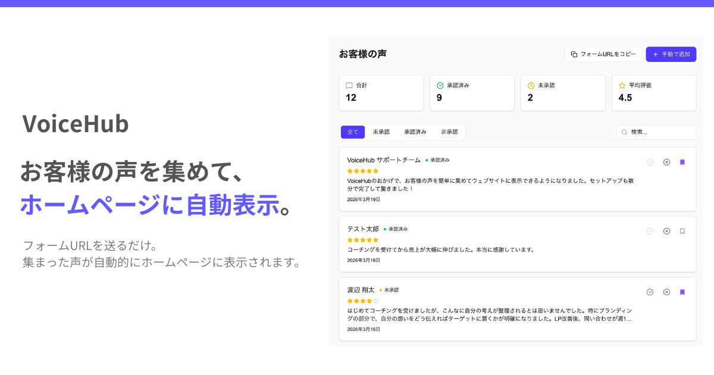
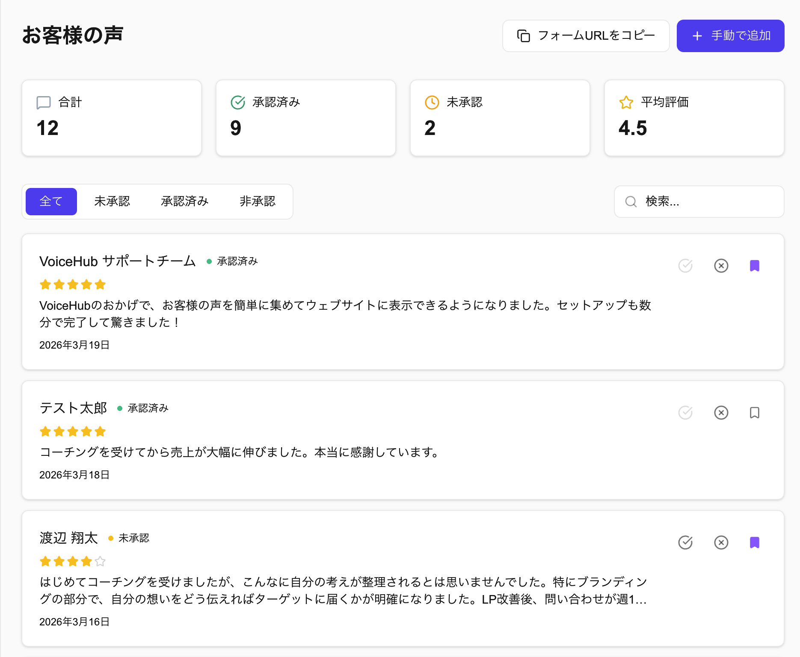
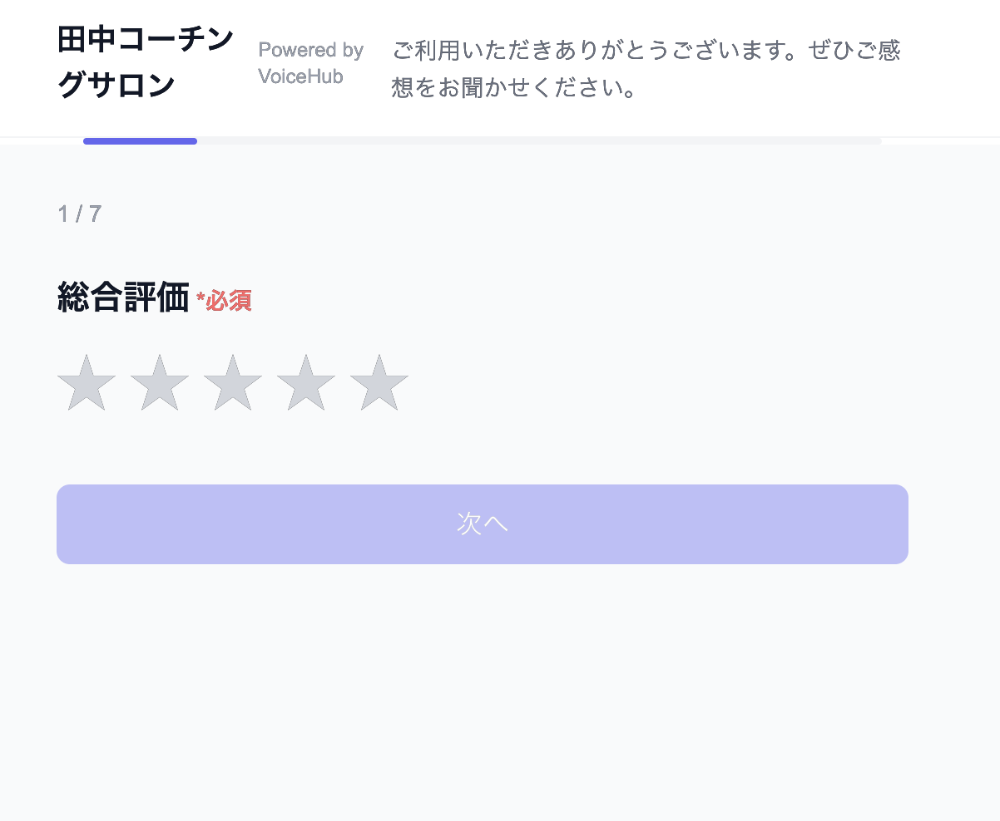
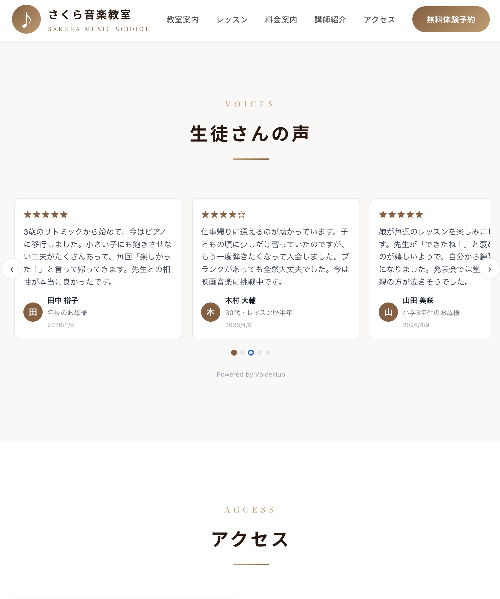
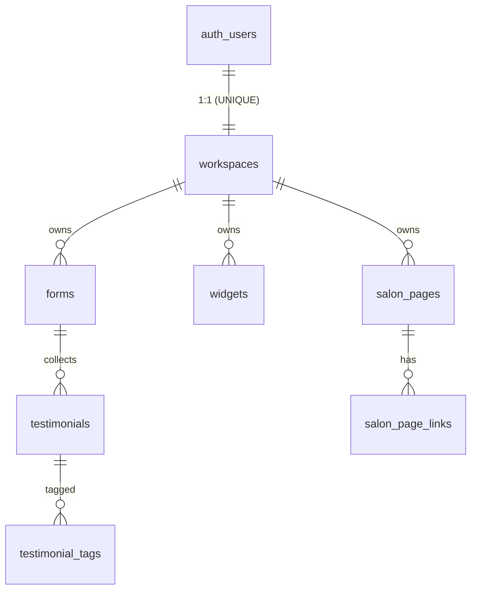

# VoiceHub

美容サロン特化の口コミ収集・公開プラットフォーム。HP に貼り付けるだけで、お客様の声が「生きた状態」で表示され続ける SaaS です。

<p align="center">
  
</p>


---

## 何を解決するプロダクトか

サロンの HP にたどり着いた見込み客は、判断材料が足りず Google マップや他店比較に流れて離脱。

本アプリは HP にコードを 1 行貼るだけで、口コミが自動更新されるウィジェットを設置できます。
サロン側は管理画面で承認するだけで**他のお客様の満足度が判断材料として伝わることで、来店転換率を向上させます**。

---

## 主要機能

| 機能                     | 説明                                                                                   |
| ------------------------ | -------------------------------------------------------------------------------------- |
| **公開口コミフォーム**   | 星評価・自由記述・カスタム質問・画像アップロードに対応                                 |
| **承認フロー**           | 管理画面でプレビュー → 公開／非公開を制御                                              |
| **ウィジェット埋め込み** | 8 種類のレイアウトを iframe で配信。HP に 1 行貼るだけで設置可                         |
| **サロン公開ページ**     | `/salon/[slug]` でロゴ・メニュー・SNS リンクを公開。HP を持たないサロンの簡易 LP       |
| **SNS 画像自動生成**     | Instagram Story / Post / X Post を Canvas API でクライアント生成（2 デザインスタイル） |
| **プラン制**             | Free / Pro (¥1,980/月) の 2 段階。プラン変更・解約はセルフサービス                     |
| **Google レビュー取込**  | Place ID から Google 口コミをインポート（重複排除付き）                                |

<p align="center">
  
  <br/>
  <em>管理ダッシュボード: 口コミ承認・ウィジェット作成・SNS 画像生成を統合</em>
</p>

<p align="center">
  
  <br/>
  <em>公開フォーム: 星評価・自由記述・カスタム質問・画像アップロード対応</em>
</p>

---

## 技術スタック

| 領域                | 採用技術                 | バージョン |
| ------------------- | ------------------------ | ---------- |
| Framework           | Next.js (App Router)     | 16.1       |
| UI                  | React / Tailwind CSS     | 19.2 / 4   |
| 言語                | TypeScript               | 5          |
| 認証 / DB           | Supabase                 | 2.99       |
| 決済                | Stripe                   | 20.4       |
| レート制限          | Upstash Redis            | 2.0        |
| バリデーション      | Zod                      | 4.3        |
| ユニット/結合テスト | Vitest + Testing Library | 4.1        |
| E2E                 | Playwright               | 1.58       |

---

## 技術的工夫

### 1. 公開ウィジェット配信パイプライン

HP に script 1 行で埋め込むウィジェットの配信系（`public/widget/v1/embed.js` 821 行）。

- **Shadow DOM をメインに採用**：HP の `<div>` に Shadow Root を直接生やし、親 CSS と分離しつつ iframe 方式より軽量（高さ同期通信や別ドキュメント生成が不要）。ノーコードツール向けに iframe 版も別途提供
- **親ページ色の auto 適応**：親要素を遡って背景色を取り、WCAG 相対輝度で明暗判定。スコープ内の `<h1>` / `<a>` 色を brand に昇格、text の明度から muted 色を線形補間で生成
- **遅延読み込み**：`IntersectionObserver` でビューポート手前まで fetch を遅らせる。失敗時は `display: none` で壊れたウィジェットを HP に出さない
- **三段の XSS 対策**：色コードはホワイトリスト検証、HTML / 属性は全件エスケープ、SSR の埋め込み JSON も `<` `>` をエスケープ

<p align="center">
  
  <br/>
  <em>HP に script 1 行で埋め込めるウィジェット — 8 種類のレイアウトを切替可能</em>
</p>

### 2. RLS + SECURITY DEFINER で公開エンドポイントを設計

7 テーブル / 28 ポリシーで RLS を構成（`supabase/` 配下）。公開クライアントが触れる範囲を最小化することを設計原則に置く。

- **testimonials INSERT ポリシーの不変条件強制**：旧 `WITH CHECK (true)` で anon が `status='approved'` の偽口コミを投入可能だったため、`status='pending'` 強制・`form_id` から逆引きした `workspace_id` の一致・`is_featured` 立て不可など 5 条件を DB レイヤーで担保
- **公開ウィジェット用 RPC**：`get_widget_public_data` 1 本で widget + プラン状態 + フィルタ済み testimonials を返し、サービスロールキーをクライアントに露出させない
- **SECURITY DEFINER の defense-in-depth**：4 関数すべてに `search_path = public, pg_temp` 固定。トリガー専用関数（`handle_new_user` / `rls_auto_enable`）からは anon / authenticated の EXECUTE 権限を剥奪し、RPC 経由で叩けないようにする
- **`workspaces.user_id` UNIQUE 制約**で 1 ユーザー = 1 ワークスペース不変条件を DB 保証。アカウント削除は `ON DELETE CASCADE` に委譲（例外は `testimonials.form_id` の SET NULL のみ）

---

## データモデル



---

## ディレクトリ構成

```
src/
├── app/
│   ├── (public)/        # ログイン・サインアップ・公開フォーム・サロンページ
│   ├── dashboard/       # 認証必須のオーナー画面
│   ├── api/             # API ルート (testimonials / forms / widgets / stripe / google-reviews ...)
│   ├── preview/         # iframe 配信専用ウィジェット
│   └── components/      # 共通 UI
├── lib/
│   ├── supabase/        # SSR クライアント・Middleware
│   ├── canvas-image-generator.ts  # SNS 画像生成（Canvas）
│   ├── rate-limit.ts    # Upstash + メモリのデュアル実装
│   ├── salon-themes.ts  # 公開ページのテーマトークン
│   ├── plan-features.ts # プラン比較情報の単一ソース
│   └── validations.ts   # Zod スキーマ集約
├── __tests__/
│   ├── unit/            # components / lib テスト
│   ├── api/             # API ルートテスト
│   ├── e2e/             # Playwright スペック
│   └── lib/
└── types/               # DB スキーマ型・プランリミット定数

supabase/               # マイグレーション + seed
.github/workflows/      # CI 定義
```

---

## ローカル起動

```bash
# 依存インストール
npm install

# 開発サーバー（ポート 3001）
npm run dev

# テスト
npm test            # Vitest
npm run test:e2e    # Playwright

# 型チェック / ビルド
npm run typecheck
npm run build
```

---

## ロードマップ

- [ ] 自動承認フック（星 N 以上で公開、Pro 課金フック）
- [ ] HP 制作会社向けのレベニューシェア管理画面
